

# 🏋️ Smart Gym Using AI Agent

### AI-Powered Smart Gym Management Mobile Application

 

---

## 📖 Project Overview

Smart Gym Using AI Agent is a modern Flutter-based mobile application developed as our graduation project.

The application digitizes traditional gym management by providing intelligent features such as AI-powered workout plans, equipment booking, real-time gym monitoring, attendance tracking, coach communication, and subscription management through an intuitive mobile experience.

The project focuses on improving both gym member engagement and operational efficiency using modern mobile technologies and artificial intelligence.

## ✨ Features

| Feature | Description |
|----------|-------------|
| 🔐 Authentication | Secure login and role-based access |
| 🤖 AI Workout Plan | Personalized AI-generated workout plans |
| 🥗 AI Diet Plan | Smart nutrition recommendations |
| 🎫 Token Booking | Reserve gym equipment using tokens |
| 📅 Session Booking | Book gym sessions easily |
| 📈 Gym Crowding | Live crowd monitoring |
| 💬 Chat with Coach | Direct communication with coaches |
| 🛍 Gym Shop | Purchase gym products |
| 📊 Attendance | QR-based attendance tracking |
| 👤 Profile | Manage user profile and subscription |

## 🛠 Tech Stack

| Category | Technologies |
|----------|--------------|
| Mobile | Flutter, Dart |
| Backend Integration | REST API |
| Database | SQL Server |
| Authentication | JWT |
| Local Storage | SharedPreferences |
| IDE | Android Studio, VS Code |
| Version Control | Git & GitHub |

## 👨‍💻 My Contribution

As the Flutter Developer of the Smart Gym Using AI Agent project, I was responsible for designing, developing, and maintaining the complete Flutter mobile application, ensuring a responsive user experience and seamless integration with backend services.

- Designing and implementing the UI/UX.
- Developing all Flutter screens.
- Integrating REST APIs.
- Authentication & Authorization.
- AI Workout & Diet screens.
- Booking System.
- Token Wallet.
- Gym Shop.
- Coach Chat.
- User Profile.
- Responsive layouts.
- Application testing and debugging.

---

# 📸 Application Screenshots

## 👤 Customer Application

| Welcome | Login | Home |
|---------|-------|------|
|  | 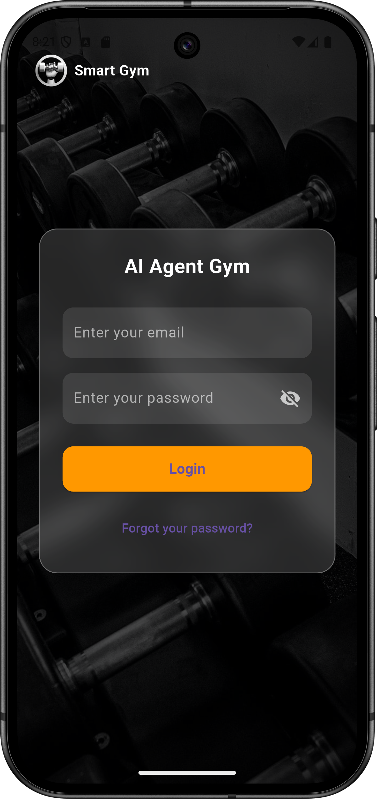 |  |

| Booking | AI Workout | AI Meal Plan |
|----------|------------|--------------|
| 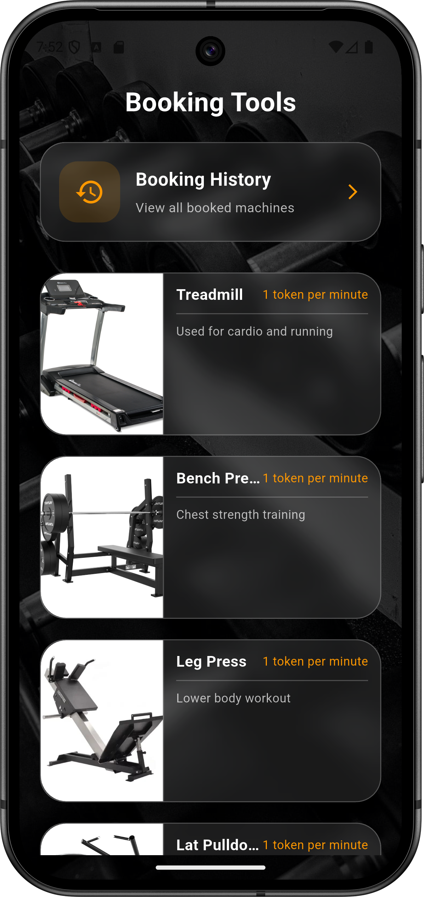 | 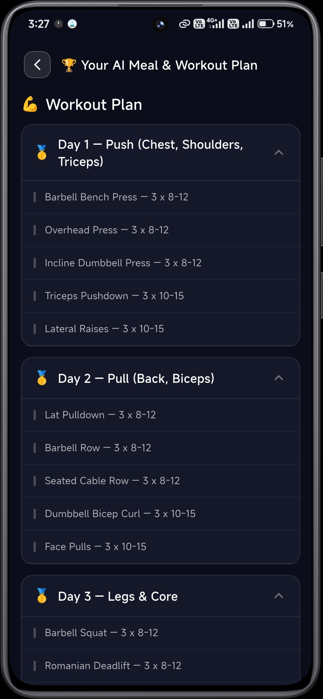 | 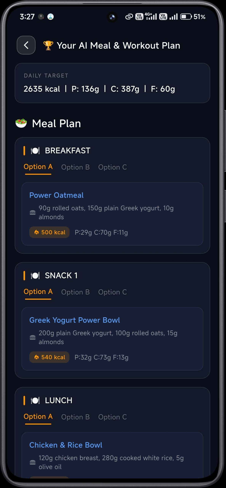 |

| Shop | Profile | Chat with Coach |
|------|----------|-----------------|
| 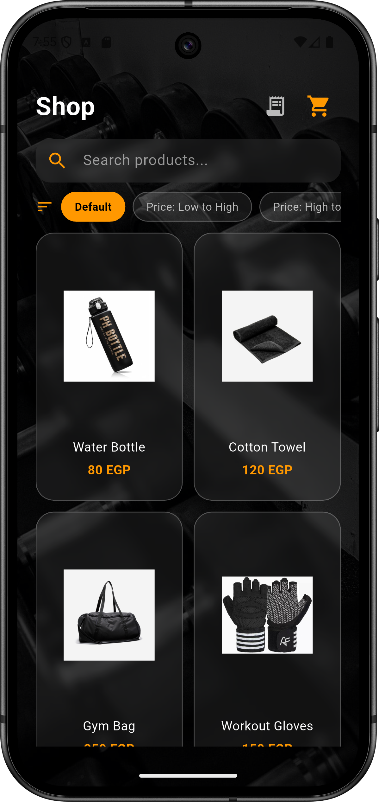 | 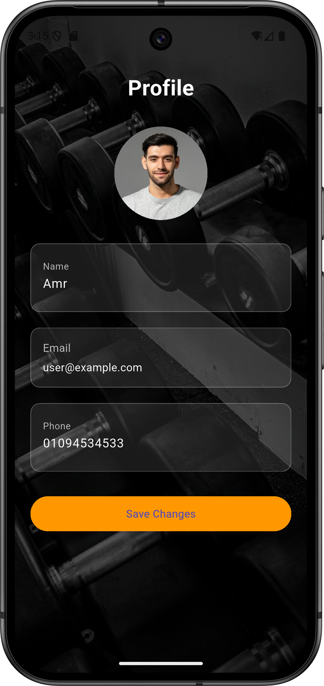 | 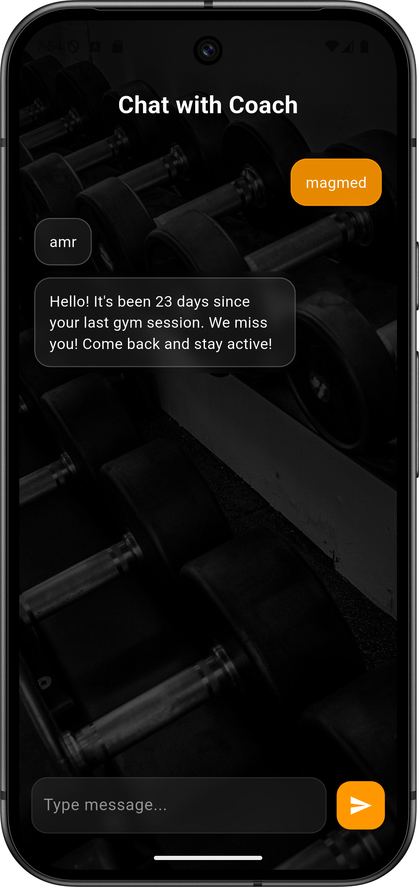 |

---

## 👨‍🏫 Coach Application

| Home | Attendance | Customer Tracking |
|------|------------|-------------------|
| 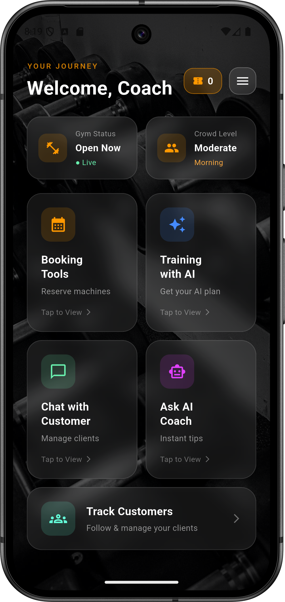 | 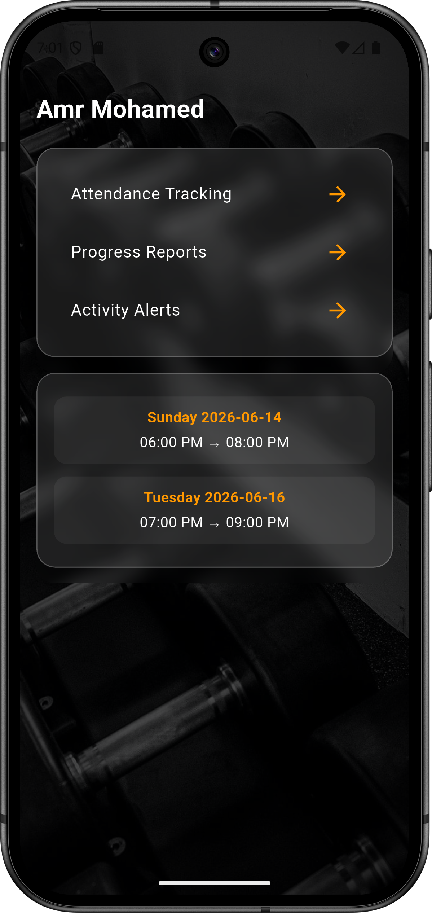 | 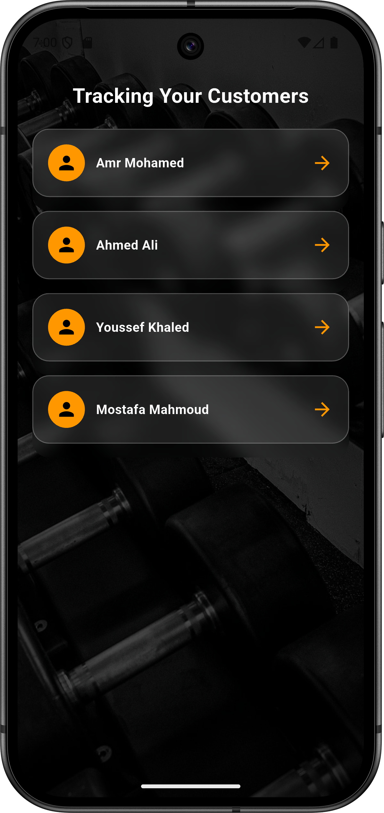 |

---

## 🖥️ Admin Dashboard

| Dashboard | Add Coach | Shop Tools |
|-----------|-----------|------------|
| 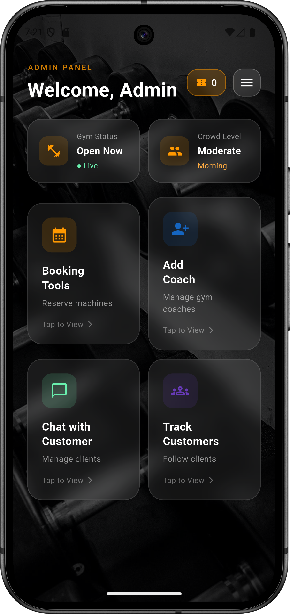 | 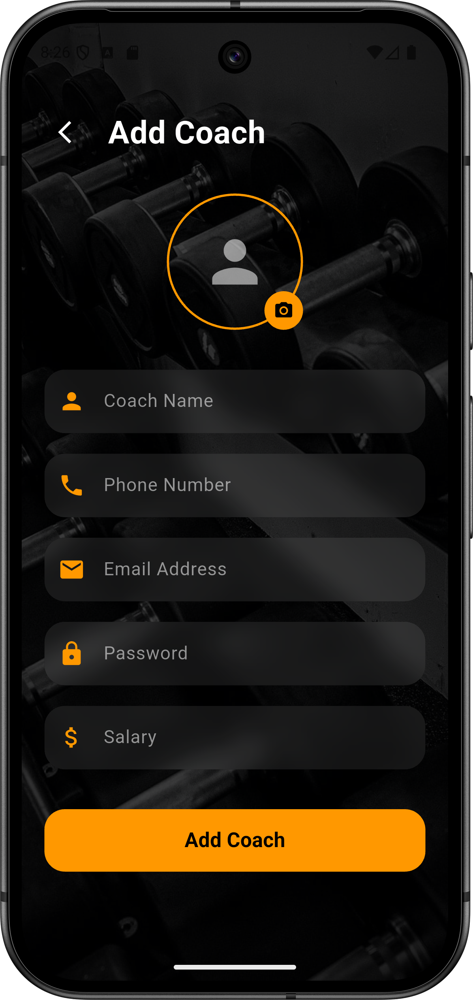 | 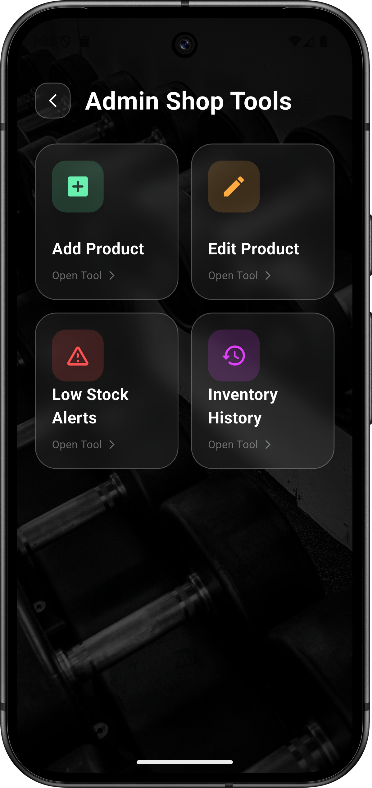 |

> 📁 Additional screenshots are available in the `screenshots` folder.

---

# 🏗️ System Architecture

The mobile application communicates with backend services through REST APIs to provide authentication, booking, AI-powered recommendations, attendance tracking, and real-time gym management.

    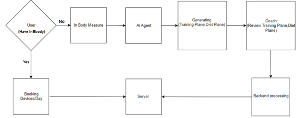

---

# 📥 Download APK

The Android application package (APK) will be available in the **Releases** section.

You can download, install, and explore the application on any Android device.

---

# 📬 Contact

**Amr Sadek**

Flutter Developer

- GitHub: https://github.com/Amr-Sadek
- Email: amrsadek510@gmail.com

---

⭐ If you found this project interesting, please consider giving it a star.

